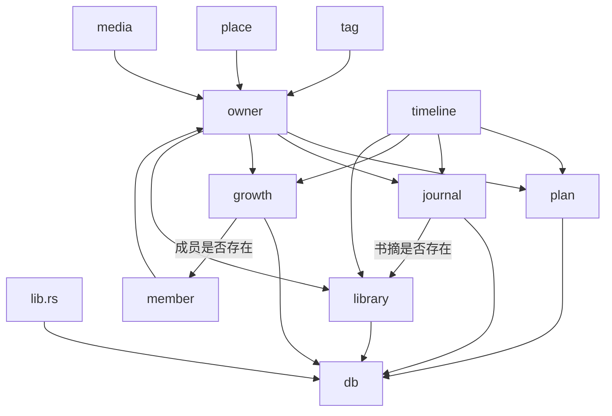

# 后端

档案库底层在 `src-tauri/src/db`：建库、开库、密钥、进程级连接。业务表不要写进 `db/`，和 `db` 同一层级，在 crate 根下自立模块。

每个模块只写自己的表。跨模块只调用对方 `pub(crate)` 的函数，并且放在同一次 `with_conn` 里。只有 `owner.rs` 和 `lib.rs` 知道全部业务模块。

旧的开发库不做迁移。表结构已全部重建，本地要手动删掉应用数据目录里的 `data/db`。

术语对照见 [glossary.md](./glossary.md)。

## 模块地图



| 模块 | 表 | 职责 |
| --- | --- | --- |
| `db` | `db_meta` | 加密库、会话、schema 版本读写 |
| `plan` | `plan`、`plan_step` | 计划 |
| `journal` | `journal_entry`、`journal_link`、`journal_citation` | 手记、流转、引用书摘 |
| `growth` | `growth_entry` | 里程碑和瞬间，`member_id` 必填 |
| `library` | `book`、`book_note` | 书，以及书摘和笔记 |
| `member` | `member`、`member_ref` | 成员，以及记录上的成员 |
| `tag` | `tag`、`tag_ref` | 标签。活着的名字唯一 |
| `place` | `place`、`place_ref` | 地点 |
| `media` | `media` | 影像元数据 |
| `timeline` | 无 | 按时间只读聚合 |
| `owner` | 无 | 归属类型，以及这条记录是否存在 |

注册顺序：`member`、`tag`、`place`、`media`、`plan`、`journal`、`growth`、`library`。`timeline` 不建表。

## 和 `db` 的边界

| | `db` | 业务模块 |
| --- | --- | --- |
| 职责 | 加密库文件、会话、`with_conn`、`db_meta` | 自己的表 |
| 连接 | 持有 `DbState` | 不 `Connection::open` |
| 文件 | `state.rs`、`storage.rs`、`schema.rs` | `service.rs`、`repository.rs` |
| 放哪 | `src-tauri/src/db/` | 与 `db` 平级 |

进程里只有一份 `DbState`。业务模块没有自己的 State。

`db` 对外是 `commands`、`dto`、`error`、`state`。`schema` 是 `pub(crate)`，给各模块读写自己的 schema 版本。`constants` 和 `storage` 是私有。`storage` 管库文件和密钥头，不是业务仓储。

密码在 `state.rs` 校验：不能为空，建库时两次必须一致，至少 8 位。短了返回「密码至少 8 位」。command 不再自己校验。

## 归属

`owner.rs` 的 `Owner`：

| 枚举 | `as_str` |
| --- | --- |
| `Plan` | `plan` |
| `JournalEntry` | `journal_entry` |
| `GrowthEntry` | `growth_entry` |
| `Book` | `book` |
| `BookNote` | `book_note` |

`Owner::parse` 把字符串变回枚举。`exists(conn, owner, id)` 分派到对应模块的 `pub(crate) fn exists`。

成员、标签、地点用引用表，不把 id 数组塞进业务表：

```text
member_ref(member_id, owner, owner_id)
tag_ref(tag_id, owner, owner_id)
place_ref(place_id, owner, owner_id)
```

主键是这三列。各模块提供 `replace`、`list_ids`、`clear`，由拥有记录的模块在同一次 `with_conn` 里调用。

影像直接写在 `media` 上：`owner`、`owner_id`、`kind`（`image` 或 `video`）、`rel_path`、`mime`、`sort`、`locked`。创建前先确认所属记录存在。删记录时调用 `media::clear`。

## 时间轴

`timeline_list(from, to, kinds?)` 在一次 `with_conn` 里调用各模块的 `list_between`，映射成 `TimelineItem`（`id`、`kind`、`occurred_at`、`title`、`body`、`locked`、`highlight`）。今天和回顾共用。

计划的发生时间是 `scheduled_at`，没有则用 `created_at`。书库只聚合 `book_note`，不把书本身放进时间轴。未知 `kind` 返回「类型不正确」。

## 目录

新模块照着 `src-tauri/src/tag` 抄。它有主表、引用表、部分唯一索引和锁库测试。

```text
src-tauri/src/<feature>/
  mod.rs          可见性、migrate，以及给别的模块用的 pub(crate) 函数
  commands.rs     Tauri IPC，只调 service，全部 async
  service.rs      校验、with_conn、测试
  repository.rs   SQL，只收 &Connection
  dto.rs          给前端的结构
  error.rs        本模块错误
  constants.rs    表名、schema 版本、kind 取值
```

`mod.rs` 可见性：

```rust
pub mod commands;
pub mod dto;
pub mod error;
mod constants;
mod repository;
mod service;
```

对外只暴露 IPC、DTO、错误。`commands` 通过 `super::service` 调用，`service` 不必 `pub`。别的模块要调用的存在性检查、区间列表、清理引用，从 `mod.rs` 以 `pub(crate)` 再导出。

## 分层

```text
前端 bridge
    ↓ invoke("tag_list")
commands     State<'_, DbState>  →  service
service      校验；db.with_conn(...)
repository   &Connection 上的 SQL
```

| 层 | 入参 | 做什么 | 不做什么 |
| --- | --- | --- | --- |
| commands | Tauri `State`、IPC 参数 | 转成 `&str`，调 service | 写 SQL、做业务校验 |
| service | `&DbState` | trim、空名、`kind`；`with_conn` | `Connection::open`、拼 SQL |
| repository | `&Connection` | 建表、CRUD、行映射 | 碰 `DbState`、自己开连接 |

跨表写入必须在同一次 `with_conn` 里调多个 repository，必要时 `conn.unchecked_transaction()`。不要每个 repository 自己再走一遍 `with_conn`。

命令全部是 `async`。同步 command 会占着主线程，数据库 IO 会卡住界面。

## 命名

- 读取用实体名：`Plan`、`JournalEntry`、`BookNote`、`Media`
- 写入用 `XxxInput`
- 命令：`<实体>_<list|get|create|update|delete>`，额外动作如 `plan_complete`
- 类型字段用 `kind`，不用 `type`
- 布尔直接用 `bool`。rusqlite 会读写，不要再包 `flag` / `bit`

## Schema 与迁移

建表不挂在每次 CRUD 上。建库或解锁成功、连接已就绪后，`DbState` 按注册顺序跑各模块的 `migrate`。

1. `repository::ensure_schema`：用 `db::schema::read_version` 读 `db_meta` 里本模块版本，按 `if current < N` 执行迁移，再用 `write_version` 写回。
2. `mod.rs` 的 `migrate` 把它转成 `DbError`：

```rust
pub(crate) fn migrate(conn: &Connection) -> Result<(), DbError> {
  repository::ensure_schema(conn).map_err(|_| DbError::Internal)
}
```

3. 在 `lib.rs` 的 `with_migrators` 里追加，并在 `invoke_handler` 注册命令。

约定：

- 版本键与探针键 `ok` 分开，形如 `tag.schema_version`。
- 升 `SCHEMA_VERSION` 时必须加对应的 `if current < N { ALTER ... }`，不要只改数字。
- `migrate` 失败：建库会关掉连接并删掉半成品；解锁则不会进入已解锁状态。
- `db` 不 `use` 任何业务模块；谁有表谁提供 `migrate`。

## 错误与 DTO

业务错误实现 `From<DbError>`，这样 `with_conn` 才能把「未解锁」转过来：

- `DbError::Locked` → 本模块的 `Locked`
- 其余库错误 → `Internal`（不要把密钥或 IO 细节漏给前端）

`thiserror` 的 `#[error("...")]` 就是给前端看的文案。再 `Serialize` 成字符串。

DTO 用 `#[serde(rename_all = "camelCase")]`。读取结构 `Serialize`，写入结构 `Deserialize`，与 `src/bridge` 对齐。

主键用 `crate::utils::id::new_uuid_v4`，时间戳用 `crate::utils::time::now_unix_ms`。

## 前端

`src/bridge/<feature>.ts` 与 command 对应。不要把业务 invoke 写进 `bridge/db.ts`。`invoke` 把后端的字符串错误转成 `Error`。

| Rust command | TS |
| --- | --- |
| `tag_list` | `tagList()` |
| `tag_create` | `tagCreate(name)` |
| 返回 `created_at` | 类型里写 `createdAt` |

在 `src/bridge/index.ts` 里 `export *`。

## 测试

写在 `service.rs` 的 `#[cfg(test)]`，打在业务 API 上（含校验、锁库），不要只测 SQL。

```rust
fn setup() -> (tempfile::TempDir, DbState) {
  let dir = tempfile::tempdir().expect("tempdir");
  let db = DbState::new(dir.path().to_path_buf()).with_migrators(vec![crate::tag::migrate]);
  db.create("test-password-123", "test-password-123").expect("create db");
  (dir, db)
}
```

`TempDir` 必须和 `DbState` 一起返回，否则目录会提前被删掉。测试密码至少 8 位。要建的表，对应 `migrate` 都要注册。

## 新模块清单

假设要加一个和标签同类的模块 `label`：

1. 复制 `src-tauri/src/tag` 为 `src-tauri/src/label`，替换表名、前缀、错误、DTO。
2. `src-tauri/src/lib.rs`：`mod label;`
3. 同一文件 `with_migrators` 追加 `label::migrate`
4. `invoke_handler` 注册 `label::commands::*`，命令用 `async`
5. 新增 `src/bridge/label.ts`，并在 `src/bridge/index.ts` 导出
6. 在 `label/service.rs` 留一条 CRUD + 锁库测试

如果它要挂到别的记录上，加 `label_ref(label_id, owner, owner_id)`，并在 `mod.rs` 导出 `replace` / `list_ids` / `clear`。不要从字符串表名去查别人的表。

## 不要做的

- 不要在 `db/` 或 `db/storage.rs` 里加业务表
- 不要给业务模块起名为 `state.rs`（那是 `DbState` 的位子）
- 不要 `Connection::open`；读写一律 `DbState::with_conn`
- 不要让 `repository` / `constants` 变 `pub`（否则会绕过 service 校验）
- 不要在热路径上 `CREATE TABLE`
- 不要只 bump 版本号而不写 `ALTER`
- 不要再拆 mapper / usecase
- 不要用同步 `pub fn` 做会碰数据库的 command
