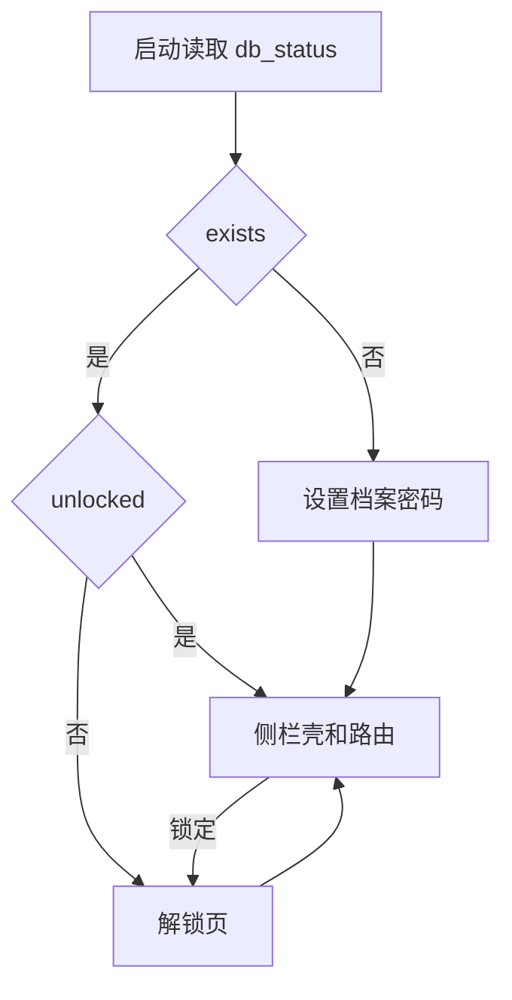
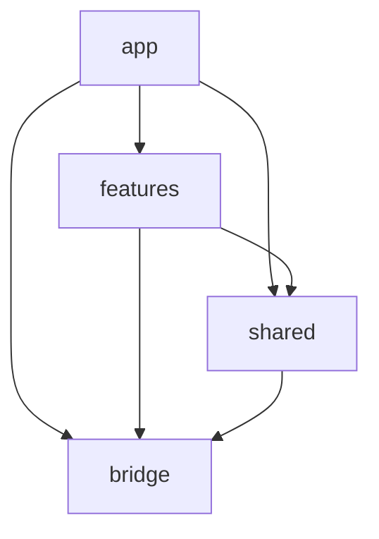

# 前端约定

界面按业务模块拆开。解锁之后才进入侧栏和路由。建库、解锁、设备槽的行为见 [device-unlock.md](./device-unlock.md)。后端模块怎么加见 [db-feature.md](./db-feature.md)。

入口在 [src/app/App.tsx](../src/app/App.tsx)。`db_demo` 仍留在后端，当作新模块的模板，不进侧栏。

## 沿用

- React 19、Vite、Biome
- CSS Modules。类名在样式文件里用 kebab-case，组件里用小驼峰。[vite.config.ts](../vite.config.ts) 里 `localsConvention` 为 `camelCase`
- [src/bridge/](../src/bridge/) 只做 `invoke`，一个后端模块一个文件

不引入组件库，也不引入 react-hook-form、zod、lucide-react、dayjs。

## 库

| 库 | 负责 |
| --- | --- |
| `@tanstack/react-router` | 已解锁之后的页面 |
| `@tanstack/react-query` | 已解锁之后从数据库来的列表和详情 |
| `zustand` | 跨组件的客户端状态，包括解锁会话 |

路由表手写在 `src/app/router.tsx`，页面从 `src/features/` 引进来。不装 `@tanstack/router-plugin`，避免页面被赶到 `src/routes/`。

Vite 已有 `@` → `src`。第一次用这个别名时，补上 [tsconfig.json](../tsconfig.json) 的 `paths`，否则 `tsc` 不认。

## 状态放哪

| 什么 | 放哪 |
| --- | --- |
| 数据库里的列表和详情 | TanStack Query |
| 跨组件的客户端状态 | Zustand |
| 一个组件里的输入、忙闲、错误文案 | 该组件的 `useState` |

共享状态用 Zustand，不用 React Context。store 只留在内存里，不写入 localStorage。

会话 store 在 `src/app/session.ts`，放 `DbStatus` 和刷新、锁定。门控和壳在用它，业务模块先不读。某个功能自己的跨组件状态放在 `src/features/<模块>/store.ts`。Query 的 key 和请求函数默认也放在该功能目录里。被第三个功能用到时，再抽到 `src/shared/`。

## 解锁门

会话是进程里的一把锁，不是缓存。建库页、解锁页不进路由。`unlocked === false` 时不挂 `RouterProvider`。



- 自动设备解锁的条件不变：`deviceUnlock` 为真且 `userLocked` 为假时调用 `db_unlock_device`。`userLocked` 为真时停在解锁页
- 点锁定：调用 `db_lock`，然后 `queryClient.clear()`。`src/app/` 再调用各功能自己导出的 reset，清掉正文和选中项。功能之间不互相 reset。再刷新 `DbStatus`。主界面卸掉，内存里不留手记正文。Query 缓存不落盘
- 会话 store 只放 `DbStatus` 和会话动作，不放手记、计划这类列表

## 业务数据

- Query 只在已解锁的树里启用
- key 用 `[模块名, ...]`，例如 `['journal', 'list']`
- 本地 IPC 失败不自动重试
- 组件不直接 `invoke`，只调 `src/bridge/`

## 目录边界

顶层按业务模块划分，底层抽一层薄的 `src/shared/`。`src/app/` 是组装根，可以引用功能和公共层。`src/bridge/` 仍是 IPC，不放进功能目录。



单向依赖：

- `features` 可以调用 `shared` 和 `bridge`
- `shared` 不能引用 `features` 里的任何业务代码
- 业务模块之间不互相 import，包括对方的 store、query 和组件
- `bridge` 不引用 `features` 或 `shared`
- 功能不引用 `src/app/`

三抽：只有被 3 个及以上业务模块用到的能力才进 `shared`。只有 2 个模块要用时，先留在各自模块里，允许把同一段请求写两遍，等第三个模块要用再抽。各模块都会用的能力（例如以后的文件选择）可以直接放 `shared`。现在不预放业务文件。

模块间要数据时，不 import 对方的 store。按这个顺序：

1. 两个模块：各自调用 `src/bridge/` 里拥有那条记录的命令。query key 都写成 `[模块名, ...]`，这样命中同一份缓存，又不用互相 import。手记里选中的 `bookId` 留在手记自己的草稿里，不把书的正文抄进手记 store。
2. 第三个模块也要：再下沉。没有业务归属的状态放进 `shared` 的 Zustand；取数则抽成 `shared` 里的 query 或服务。
3. 只是通知对方刷新，又不适合同一个 query key：用 `shared` 里的事件通道，不另加库。读数据不用事件通道。

需要联表时，命令落在发起这个界面的后端模块里，规则仍按 [db-feature.md](./db-feature.md)。前端不维护一份拼好的副本。

## 路由与壳

History 用 hash。打包后的 WebView 没有 SPA 回退，hash 在刷新和 Android 返回时更稳。

侧栏三组、八个入口，默认打开「今天」：

| 路径 | 入口 | 目录 |
| --- | --- | --- |
| `/today` | 今天 | `src/features/today/` |
| `/plan` | 计划 | `src/features/plan/` |
| `/journal` | 手记 | `src/features/journal/` |
| `/growth` | 成长 | `src/features/growth/` |
| `/library` | 书库 | `src/features/library/` |
| `/toolbox` | 工具箱 | `src/features/toolbox/` |
| `/review` | 回顾 | `src/features/review/` |
| `/settings` | 设置 | `src/features/settings/` |

手记编辑在 `/journal/$entryId`，阅读器在 `/library/$bookId`，年度之书在 `/review/year`。这三页和上面的入口一样先留空。

壳在 `src/app/shell/`。侧栏底部放「锁定」。设备槽的启用和关闭也从壳进入，不做成产品模块。窄屏以后可以把侧栏收起来，现在不另做一套底栏。

## 目录

```
src/
  app/
    App.tsx
    session.ts
    query.ts
    router.tsx
    gate/
    shell/
  features/
    today/
    plan/
    journal/
    growth/
    library/
    toolbox/
    review/
    settings/
  shared/
  bridge/
```

每个功能目录放该模块的页面、组件、CSS Module 和 store。不按库的种类再分一层。`shared/` 先空着，等第三个使用方出现再放文件。
