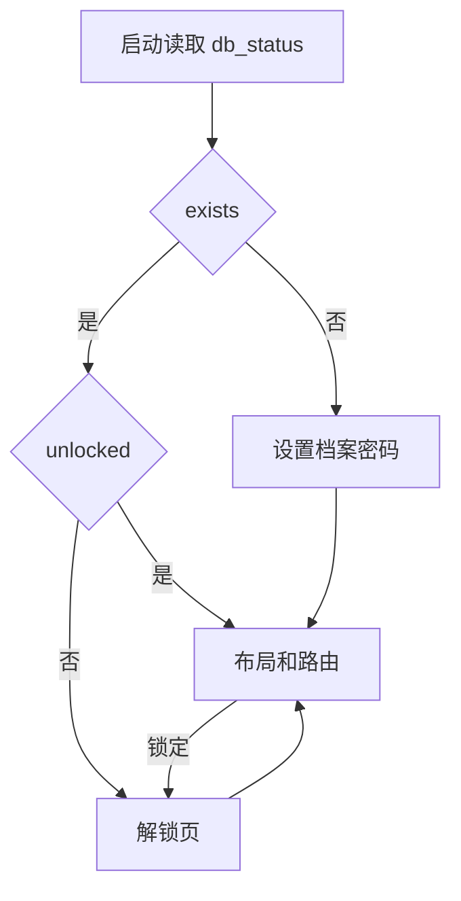
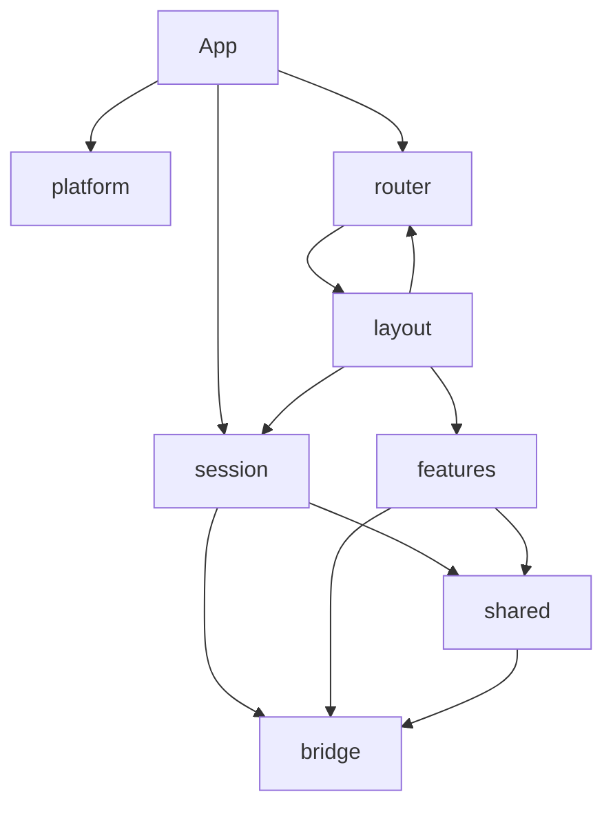

# 前端约定

界面按业务模块拆开。解锁之后才进入布局和路由。建库、解锁、设备解锁见 [device-unlock.md](./device-unlock.md)。后端模块怎么加见 [backend.md](./backend.md)。术语见 [glossary.md](./glossary.md)。

`src/App.tsx` 只组装：`SessionGate`、`QueryClientProvider`、`RouterProvider`。

## 沿用

- React 19、Vite、Biome
- CSS Modules。类名在样式文件里用 kebab-case，组件里用小驼峰。[vite.config.ts](../vite.config.ts) 里 `localsConvention` 为 `camelCase`
- [src/bridge/](../src/bridge/) 只做 `invoke`，一个后端模块一个文件

不引入组件库，也不引入 react-hook-form、zod、lucide-react、dayjs。

## 库

| 库 | 负责 |
| --- | --- |
| `@tanstack/react-router` | 已解锁之后的页面 |
| `@tanstack/react-query` | 已解锁之后从数据库来的列表和详情 |
| `zustand` | 跨组件的客户端状态，包括解锁会话 |
| `@phosphor-icons/react` | 界面图标。`weight="regular"`，尺寸用 `--icon-sm`、`--icon-md` |

路由表手写在 `src/router/index.tsx`。不装 `@tanstack/router-plugin`，避免页面被赶到 `src/routes/`。

Vite 已有 `@` → `src`。`tsconfig.json` 的 `paths` 要一起配，否则 `tsc` 不认。

## 状态放哪

| 什么 | 放哪 |
| --- | --- |
| 数据库里的列表和详情 | TanStack Query |
| 跨组件的客户端状态 | Zustand |
| 一个组件里的输入、忙闲、错误文案 | 该组件的 `useState` |

共享状态用 Zustand，不用 React Context。store 只留在内存里，不写入 localStorage。

## 平台

`src/platform/index.ts` 在 `main.tsx` 渲染前执行。`__TAURI_INTERNALS__.plugins` 里有 `device-slot` 时视为 Android，否则看视口宽度，窄于 720px 视为移动。结果写到 `<html data-platform="desktop|mobile" data-touch-ui="true|false">`，并监听 `resize`。`style/index.css` 里的 `data-touch-ui` 规则因此生效。

`src/layout/index.tsx` 观察 `data-platform`，渲染 `DesktopLayout` 或 `MobileLayout`。两套布局共用一份路由，都渲染 `<Outlet />`。

## 解锁门

会话是进程里的一把锁，不是缓存。建库页、解锁页不进路由。`unlocked === false` 时不挂 `RouterProvider`。分流在 `src/session/gate.tsx`。


```mermaid
flowchart TD
  boot[启动读取 db_status]
  boot --> missing{exists}
  missing -->|否| create[设置档案密码]
  missing -->|是| locked{unlocked}
  locked -->|否| unlock[解锁页]
  locked -->|是| layout[布局和路由]
  create --> layout
  unlock --> layout
  layout -->|锁定| unlock
```

- 自动设备解锁的条件不变：`deviceUnlock` 为真且 `userLocked` 为假时调用 `db_unlock_device`。`userLocked` 为真时停在解锁页
- 点锁定：`db_lock`，然后 `queryClient.clear()`，再刷新 `DbStatus`。主界面卸掉，Query 缓存不落盘
- 某个功能有了 `store.ts` 之后，再导出 `reset`，并在 `src/session/store.ts` 的 `lock` 里登记一行。功能之间不互相 reset。现在没有这类 store，也不预放空的 `reset.ts`
- 会话 store 只放 `DbStatus` 和会话动作，不放手记、计划这类列表

设备解锁面板在 `src/session/device-unlock.tsx`。设置页不引用 `session`。`src/router/index.tsx` 把 `<DeviceUnlock />` 作为 `deviceUnlock` 传给 `SettingsPage`。

## 业务数据

- Query 只在已解锁的树里启用
- key 用 `[模块名, ...]`，例如 `['member', 'list']`
- 本地 IPC 失败不自动重试
- 组件不直接 `invoke`，只调 `src/bridge/`
- `src/bridge/invoke.ts` 把后端字符串错误转成 `Error`。调用方拿到的永远是 `Error`
- 读取类型用实体名，写入用 `XxxInput`，类型字段用 `kind`

## 目录边界

顶层按职责平铺，不收进 `app/`。`session` 只管档案会话，`router` 只管路由表、路径常量和路由清单，`layout` 只管页面外围的常驻布局。


```mermaid
flowchart TD
  appEntry[App]
  platformNode[platform]
  sessionNode[session]
  routerNode[router]
  layoutNode[layout]
  featuresNode[features]
  sharedNode[shared]
  bridgeNode[bridge]
  appEntry --> platformNode
  appEntry --> sessionNode
  appEntry --> routerNode
  routerNode --> layoutNode
  layoutNode --> sessionNode
  layoutNode --> featuresNode
  layoutNode --> routerNode
  sessionNode --> sharedNode
  sessionNode --> bridgeNode
  featuresNode --> sharedNode
  featuresNode --> bridgeNode
  sharedNode --> bridgeNode
```

单向依赖：

- `features` 不引用 `session`、`layout`、`router`
- `shared` 不引用 `features`，也不引用组装层
- `bridge` 不引用 `features`、`shared` 和组装层
- 业务模块之间不互相 import。要对方的数据时走 `shared/data`，或直接调 `bridge`，query key 用同一份
- `platform` 不引用任何业务代码

三抽：只有被 3 个及以上业务模块用到的能力才进 `shared`。只有 2 个模块要用时，先留在各自模块里。

## 路由与布局

History 用 hash。打包后的 WebView 没有 SPA 回退，hash 在刷新和 Android 返回时更稳。

路径常量在 `src/router/path.ts`：

| 常量 | 路径 | 页面 |
| --- | --- | --- |
| `root` | `/` | 转到今天 |
| `today` | `/today` | 今天 |
| `plan` | `/plan` | 计划 |
| `journal` | `/journal` | 手记 |
| `journalEntry` | `/journal/$entryId` | 编辑手记 |
| `growth` | `/growth` | 成长 |
| `library` | `/library` | 书库 |
| `bookReader` | `/library/$bookId` | 阅读 |
| `toolbox` | `/toolbox` | 工具箱 |
| `review` | `/review` | 回顾 |
| `yearBook` | `/review/year` | 年度之书 |
| `settings` | `/settings` | 设置 |

`src/router/items.ts` 是侧栏和底栏共用的路由清单。每项带 `surfaces`：

| surface | 出现在 |
| --- | --- |
| `sidebar` | 桌面侧栏 |
| `tab` | 移动底栏里的独立一项 |
| `record` | 移动「记录」里的分段 |
| `mine` | 移动「我的」里的分段 |

侧栏三组：记录（今天、计划、手记、成长、书库）、整理（工具箱、回顾）、系统（设置）。

底栏：今天、记录、记一笔、书库、我的。「记录」链到 `/journal`，分段是计划 / 手记 / 成长。「我的」链到 `/settings`，里面是工具箱、回顾、设置。进入 `/plan`、`/journal`、`/growth` 时底栏高亮「记录」。

带维度的导航项在清单里写 `tone`，样式用对应的 token，不在组件里写死色值。

## 记一笔和命令面板

只有布局会打开这两个浮层，并且它们要读路由清单，所以放在 `layout/`，不进 `shared`。

- `layout/overlay.tsx`：遮罩、`Esc` 关闭、关闭后焦点回到触发按钮，层级用 `--z-modal`。桌面居中，移动端从底部升起，用同一个组件的 placement 区分
- `layout/capture.tsx`：列出日记、灵感、写作、计划、里程碑、瞬间、书摘，点了就跳到对应路径
- `layout/command.tsx`：按标签过滤 `router/items.ts` 并跳转。记录搜索留空态「记录搜索还没有内容。」
- 快捷键 `⌘K` / `Ctrl+K` 在 `layout/index.tsx`

页面还是空的，浮层里不做表单，不做记录搜索，不做动效体系。

## 功能目录

```text
features/<模块>/
  page.tsx            模块首页，导出 XxxPage
  <名词>-page.tsx     子页面，例如 journal/entry-page.tsx
  query.ts            该模块的 query key 和请求函数，出现第一个请求时再建
  store.ts            该模块的客户端状态，出现第一个跨组件状态时再建
  components/         只被本模块使用的组件，出现第二个组件时再建目录
  <名字>.module.css   与组件同名
```

不按库的种类再分一层，也不预建空文件。页面骨架样式用 `shared/ui/page.module.css`。

## shared

- `shared/ui/`：无业务的界面。`page.module.css` 是页面骨架，`empty-state.tsx` 是空态
- `shared/data/`：跨模块的领域数据。每个子目录含 query key、hooks 和小组件。现在有 `member/` 和 `timeline/` 的 query。组件等第一个使用界面出现再加
- `shared/lib/error.ts`：`errorMessage`，各功能显示错误时用它

## 目录

```text
src/
  main.tsx
  App.tsx
  platform/index.ts
  session/
    gate.tsx
    create.tsx
    unlock.tsx
    lock-button.tsx
    device-unlock.tsx
    store.ts
    query-client.ts
  router/
    path.ts
    items.ts
    index.tsx
  layout/
    index.tsx
    desktop.tsx
    mobile.tsx
    overlay.tsx
    capture.tsx
    command.tsx
    layout.module.css
  features/
  shared/
    ui/
    data/
    lib/
  bridge/
  style/
    token.css
    reset.css
    index.css
```

## 样式

颜色用 `--background`、`--foreground`、`--muted-foreground`、`--border`、`--card`、`--destructive`。尺寸用 `--sidebar-w`、`--space-*`、`--radius-*`、`--header-h`、`--dock-h`。层级用 `--z-modal`。

维度色在 `style/token.css`：`--plan`、`--journal`、`--growth`、`--library`、`--toolbox`，以及各自的 `--*-soft`。`html.dark` 下有对应值。暗色因此跟着 token 走，组件里不写死另一套色。
